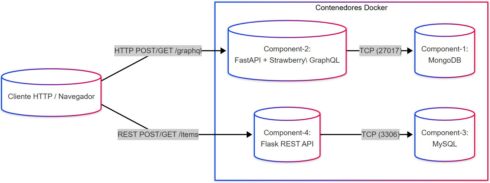

# Daniel Felipe Villamor

## Vista de Componentes y Conectores

---

## Descripción de Componentes

1. **Component-1 (MongoDB)**

   * Imagen oficial de MongoDB.
   * Expone el puerto TCP 27017.
   * Almacena la colección `items` que usará el servicio GraphQL.

2. **Component-2 (FastAPI + Strawberry-GraphQL)**

   * Servicio Python basado en FastAPI y Strawberry.
   * Define un esquema GraphQL con consultas (`items`) y mutaciones (`addItem`).
   * En el arranque, inicializa la conexión MongoDB leyendo `DB_HOST` y `DB_NAME` del entorno.
   * Expone `/graphql` por HTTP en el puerto 8000.

3. **Component-3 (MySQL)**

   * Imagen oficial de MySQL 8.
   * Variables de entorno: `MYSQL_ROOT_PASSWORD`, `MYSQL_DATABASE`.
   * Expone el puerto TCP 3306.
   * Tabla `items` creada manualmente durante pruebas.

4. **Component-4 (Flask REST API)**

   * Servicio Python basado en Flask.
   * Rutas REST:

     * `GET  /items` → devuelve todos los ítems desde MySQL.
     * `POST /items` → inserta un nuevo ítem en MySQL.
   * Se conecta a MySQL leyendo `DB_HOST`, `DB_USER`, `DB_PASSWORD`, `DB_NAME` del entorno.
   * Expone HTTP en el puerto 8001.

---

## Descripción de Conectores

1. **Conector TCP entre Component-2 y Component-1**

   * Protocolo: MongoDB Wire Protocol sobre TCP.
   * Host: `mongodb://component-1:27017` dentro de la red Docker.

2. **Conector TCP entre Component-4 y Component-3**

   * Protocolo: MySQL sobre TCP.
   * Host: `component-3:3306` dentro de la red Docker.

3. **Conector HTTP/REST entre Cliente y Component-4**

   * Cliente envía solicitudes HTTP `GET` y `POST` a `http://localhost:8001/items`.

4. **Conector HTTP/GraphQL entre Cliente y Component-2**

   * Cliente (navegador o cliente GraphQL) envía consultas y mutaciones a `http://localhost:8000/graphql`.

5. **Conector de Red Podman**

   * Todos los servicios comparten la misma red de Podman creada por `podman-compose`, lo que permite resolución de nombres de contenedor y comunicación directa.